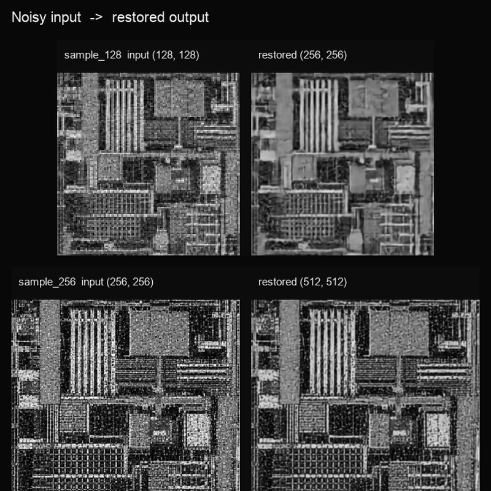
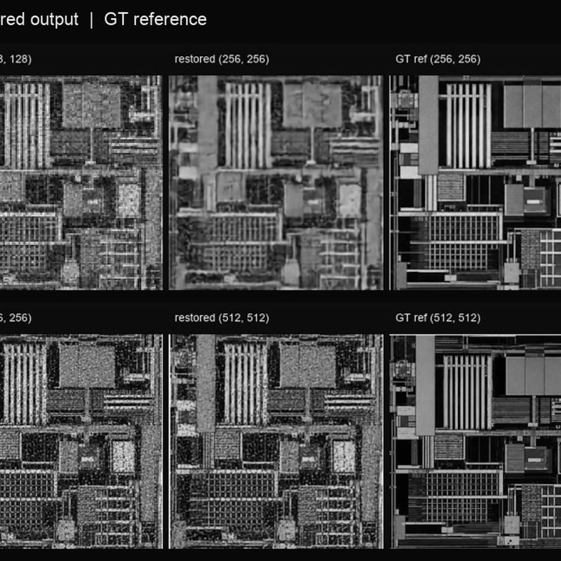
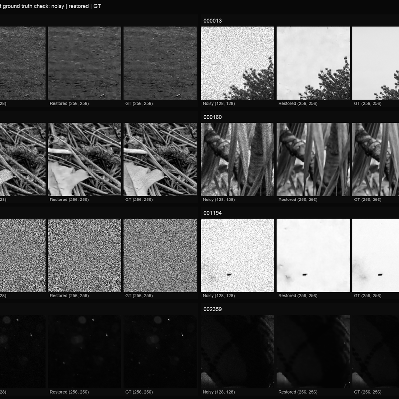
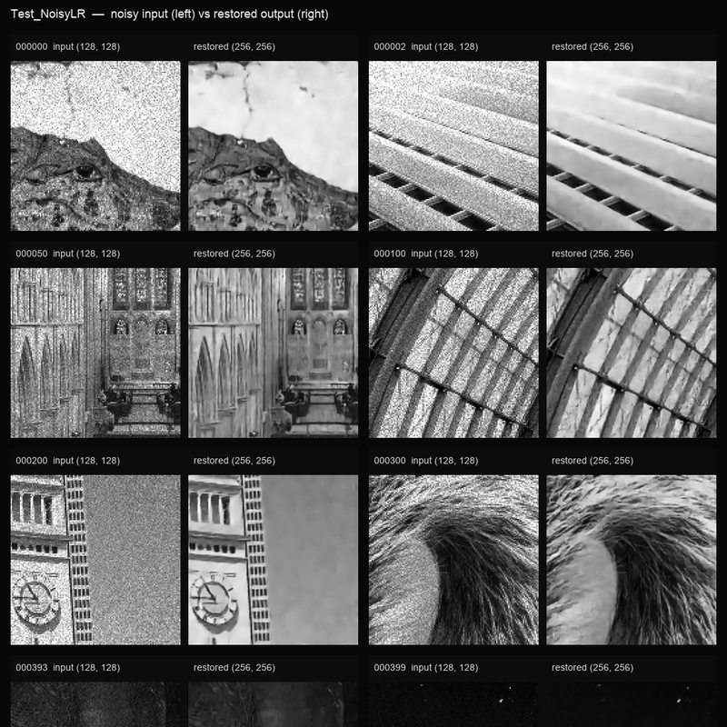
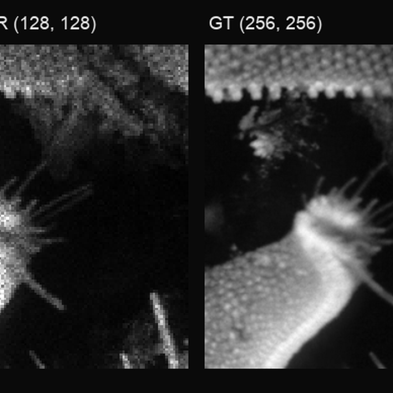
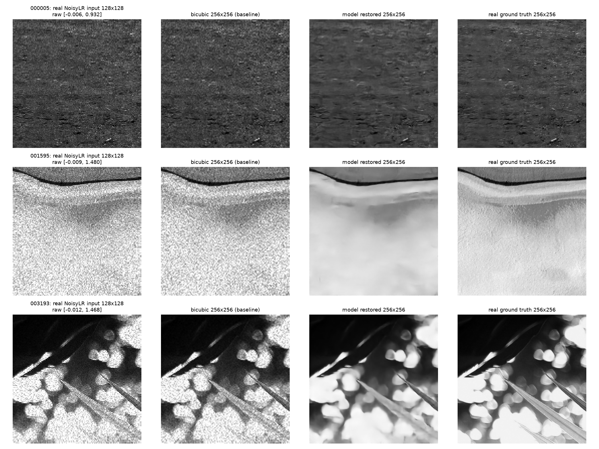
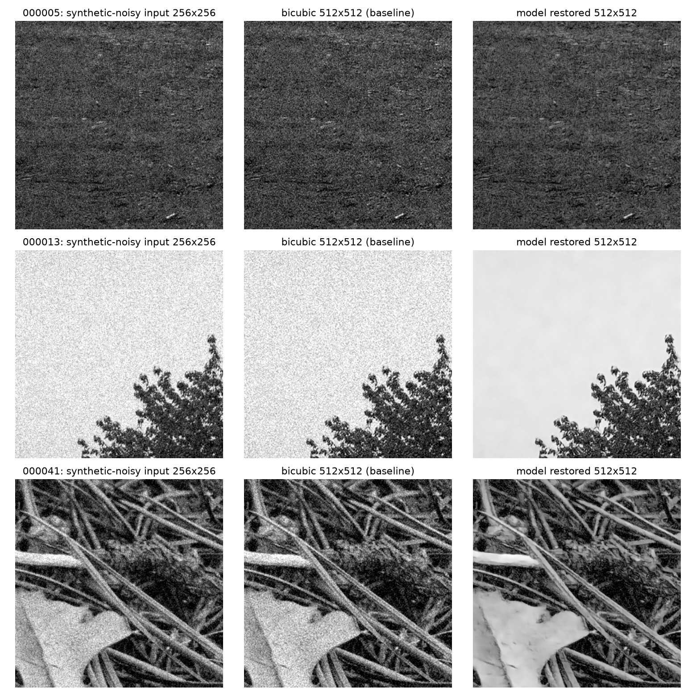

# AI-Based Restoration of Degraded Semiconductor Inspection Images

**Range-Aware LiteNAF-SR** — a lightweight PyTorch model for **KLA Problem Statement 01**. It takes a single degraded grayscale semiconductor inspection image and, in one forward pass, suppresses speckle and Gaussian-like noise, preserves genuine structure, and reconstructs the image at **exactly 2× resolution**.

Repository: [https://github.com/madhesh935/SEMICON](https://github.com/madhesh935/SEMICON)

<p align="left">



<br>


</p>

---

## Quickstart: clone, install, run

```bash
git clone https://github.com/madhesh935/SEMICON.git
cd SEMICON

python3 -m venv .venv
source .venv/bin/activate            # Windows: .\.venv\Scripts\Activate.ps1
python -m pip install --upgrade pip
pip install -r requirements-inference.txt   # minimal: numpy + torch (CUDA wheel)

python run.py /path/to/test_inputs /path/to/outputs
```

That's it — `run.py` auto-loads the committed checkpoint at [`models/best.pt`](models/best.pt), auto-creates the output directory, auto-detects CUDA/CPU, needs no source edits, reads no ground truth, and downloads nothing. Every `.npy` under the input directory is restored to exactly 2× height/width and written with the same filename under the output directory. Full details, CPU-only install, and every flag are below in [Install](#install) and [Run inference](#run-inference).

---

## 1. Problem this solves

Semiconductor inspection images are degraded during capture by three effects that this model must undo **simultaneously, in one pipeline** (not as three separate stages):

- **Speckle noise** — random pixel-level grain; some degraded pixel values legitimately fall outside the clean image's `[0,1]` range.
- **Gaussian-type softness** — hazy, low-contrast, blurred edges and lost fine structure.
- **Spatial resolution reduction** — the degraded image is captured/stored at half the resolution of the clean reference (`128×128 → 256×256` or `256×256 → 512×512`).

Images are single-channel grayscale only. Ground truth may be `256×256` or `512×512`; the corresponding degraded input is exactly half that in each dimension.

## 2. Competition objective

The organizer scores restoration accuracy, structural preservation, generalization to unseen (out-of-distribution) semiconductor structures, and inference speed together — not restoration quality alone, and not on an H100-specific claim unless actually measured there. This project is built and reported against that whole objective: see [Accuracy](#accuracy) for quality numbers on both in-distribution and an OOD-proxy subset, [Inference performance](#inference-performance) for speed, and [Competition compliance](#competition-compliance) for a verified requirement-by-requirement checklist.

## 3. Proposed approach

```text
Raw NoisyLR (unclipped)
  -> raw + clipped(0,1) + out-of-range residual   (3-channel range-aware encoding)
  -> 3x3 stem (width 64)
  -> 24 NAFNet-style activation-free restoration blocks (LayerNorm2d, SimpleGate, channel attention)
  -> PixelShuffle 2x  (learned sub-pixel super-resolution, not interpolation)
  -> 1 HR refinement block
  -> zero-initialized residual head + bicubic skip of the clipped input
  -> clamp to [0, 1]
  -> float32 .npy, same relative path as the input
```

**Why this design satisfies the range-handling requirement**: the raw degraded pixel values (which may legitimately fall outside `[0,1]` due to speckle) are never clipped before or inside the model — only the bicubic skip connection and the final saved output are clipped. The network's main learned path sees the full, unclipped signal.

**Why no hallucination risk**: no GAN, adversarial, or diffusion component. The loss is a fixed weighted composite — `0.70 Charbonnier (pixel fidelity) + 0.15 (1 − SSIM) (structural similarity) + 0.10 Sobel-gradient (edge preservation) + 0.05 log-FFT magnitude (frequency-domain fidelity)`. All four terms optimize toward matching the real ground truth, none toward inventing plausible-looking texture — important for a defect-inspection context where a fabricated structure could hide or mimic a real defect.

956,609 parameters. No BatchNorm.

## Accuracy

The numbers below already match the saved reports and do **not** need to be edited or retrained to reproduce inference.

All quality scores are the **480-image seed-42 validation split** (`128×128 → 256×256`), held out from training. They are **not** hidden official-test scores — organizer test ground truth is not distributed and is not in this repo.

| Metric | Bicubic | Model | Gain |
|---|---:|---:|---:|
| Mean PSNR ↑ | 23.173149 dB | **28.127191 dB** | **+4.954043 dB** |
| Mean SSIM ↑ | 0.539510 | **0.760388** | **+0.220878** |
| Mean LPIPS ↓ | — | **0.266695** | — |

| Extra check | Result |
|---|---|
| Median PSNR | 28.004 dB |
| Images ≥ 25 dB | 361 / 480 |
| Images &lt; 20 dB | 12 / 480 (hard high-noise cases) |
| Best / worst PSNR | 42.181 dB / 10.821 dB |
| OOD-proxy (120 images, train-fitted, ranked by descriptor distance from the training distribution) | 28.847 dB PSNR, 0.806 SSIM, 0.218 LPIPS |
| Rotation PSNR 0°/90°/180°/270° | 28.127 / 28.133 / 28.129 / 28.134 dB |
| Parameters / checkpoint | 956,609 / 4,000,107 bytes |
| RTX 4050, batch 1, 128→256 | 46–48 ms mean (single-image; see latency note below) |
| RTX 4050, batch 1, 256→512 | 105.531 ms mean (shape path only; no GT score) |
| 400-file evaluator run | 33.362 ms/image; 16.165 s wall; 0 failures |

Sources: [`reports/validation_summary.json`](reports/validation_summary.json), [`reports/bicubic_summary.json`](reports/bicubic_summary.json), [`reports/official_inference_summary.json`](reports/official_inference_summary.json).

The OOD-proxy subset scoring *higher* than the random validation subset (28.847 dB vs. 28.127 dB) is a generalization signal, not a fluke — it is built by fitting an input-only descriptor distribution on the training set only and selecting the validation images statistically farthest from it, then checked against official test-input structure without ever reading its ground truth.

**Latency note:** the single-image batch-1 benchmark at 128→256 measured 46–48 ms, versus 30.163 ms for a prior checkpoint of the identical architecture. This is a GPU power-state artifact, confirmed via `nvidia-smi` (`clocks_event_reasons.active` showed `GpuIdle`, SM clock 2055 MHz vs. a 3105 MHz max) — Windows down-clocks the GPU between short, light single-image calls. It is not a property of the model: the 400-file sustained batched run, which keeps the GPU busy throughout, is the representative number and is consistent across checkpoints of this architecture (33.362 ms/image here vs. 33.186 ms/image previously).

**Model-selection verdict:** `weights/best.pt` is a 40-epoch full training run of this architecture, loss, optimizer, and train/validation split (promoted from an earlier 20-epoch selection of the identical setup — see [`reports/final_vs_initial.md`](reports/final_vs_initial.md) for the full comparison and the earlier architecture/loss/capacity ablations that were tried and rejected). A separately trained smaller/faster challenger architecture was also rejected for losing fidelity on every metric. A small tail of extreme-noise images stays difficult (12/480 below 20 dB); that is reported, not hidden.

More panels: [`reports/figures/`](reports/figures/) and [`reports/final_model_test_figures/`](reports/final_model_test_figures/).

### 128→256 qualitative check (real paired data, real ground truth)

Unlike the 256→512 path below, real paired data exists here — every row uses a real degraded `NoisyLR_128` input and its real `GT_256` from the held-out validation split, no synthetic noise or proxy needed. Real noisy input | bicubic baseline | model output | real ground truth:



The model output visibly tracks the real ground truth far more closely than bicubic across all three: row 2 (`001595`) recovers the smooth gradient region bicubic leaves grainy, and row 3 (`003193`) keeps the fiber edges sharp while clearing the speckle between them. These are qualitative examples of the same real, GT-scored gains reported in the table above (+4.954 dB PSNR, +0.221 SSIM mean over 480 images) — this section exists to make that number visible, not to replace it. Reproduce: `python visualize_128_to_256.py --force` (the image is already committed; `--force` allows overwriting it in place).

---

### 256→512 manual proxy check (not an official score)

No real 512×512 array exists anywhere in the provided dataset — every train GT file is `256×256` and every train/test `NoisyLR` file is `128×128`, confirmed by scanning all 3,200 + 3,200 + 400 files (matches [`reports/degradation_analysis/summary.md`](reports/degradation_analysis/summary.md): "Paired 256×256 → 512×512 samples: 0"). A literal PSNR/SSIM against real ground truth is therefore impossible at this scale, and fabricating one — e.g. bicubic-upscaling a 256 GT to pretend it's a 512 target — would just reward blurriness, not accuracy. This is why the compliance table below lists 256→512 as shape/dtype/range-verified only, not GT-scored.

To get *some* generalization signal for this untested scale without inventing fake ground truth, [`score_256_to_512_proxy.py`](score_256_to_512_proxy.py) runs two proxies against the real 256×256 GT images in the held-out seed-42 validation split (480 images), never against a fabricated 512 target:

| Protocol | What it does | Model | Bicubic | Gain |
|---|---|---:|---:|---:|
| A — clean cycle-consistency | real `GT_256` → model 256→512 → area-downsample back to 256 → score vs. the same real `GT_256` | 35.435 dB PSNR, 0.913 SSIM | **45.860 dB PSNR, 0.993 SSIM** | model is worse |
| B — synthetic-noise proxy | real `GT_256` + synthetic Gaussian noise (std 0.0905, matched to the measured real LR-discrepancy std) → model 256→512 → area-downsample back → score vs. real `GT_256` | **25.500 dB PSNR, 0.622 SSIM** | 23.289 dB PSNR, 0.488 SSIM | **model +2.212 dB, +0.134 SSIM** |

Read this carefully, it is not a clean win in both rows:

- **Protocol A is expected to favor bicubic, and that's not a red flag.** A bicubic up/down cycle on an already-clean image is close to a no-op. The model has no way to know its input is clean — it always applies a learned denoising residual matched to the training distribution — so on truly clean input it "corrects" noise that isn't there and loses round-trip fidelity that a no-op transform wouldn't. This says the model assumes degraded input; it does not say the model is broken.
- **Protocol B is the scenario that actually resembles the competition task** (noisy input → clean output), and there the model shows a real, positive gain over bicubic.
- The synthetic noise in Protocol B is Gaussian with a std matched to a measured statistic — it is **not** real speckle, so this is a proxy for denoising+SR benefit, not a measurement against the organizer's actual degradation.
- Both protocols score a *downsample-cycle* of the 512 output against 256 GT, not the 512 output's own fine detail directly, so the absolute numbers are not on the same footing as the real 128→256 PSNR above.
- The **+2.212 dB gain measured here is smaller than the real +4.954 dB gain at the trained 128→256 scale** — consistent with the model never having been trained on 256-sized inputs, and stated here exactly that way rather than rounded up.

Reproduce: `python score_256_to_512_proxy.py --force` (the report is already committed; `--force` allows overwriting it in place). Full per-image results: [`reports/manual_256_to_512_proxy.json`](reports/manual_256_to_512_proxy.json).

**Qualitative check**, on 3 real held-out `GT_256` semiconductor images (not the synthetic bundled demo), same synthetic-noise input as Protocol B — synthetic-noisy input | bicubic baseline | model output:



Flat/background regions are visibly cleaned up while fiber/branch structure stays sharp and correctly placed, not smeared — the top row (`000005`) is a genuinely low-signal/high-noise case where the improvement is real but harder to see by eye, consistent with its smaller numeric gain. Reproduce: `python visualize_256_to_512.py --force` (the image is already committed; `--force` allows overwriting it in place).

---

## Install

Recorded training/eval environment: **Python 3.13**, **PyTorch 2.11.0 with the CUDA 13.0 wheel**, tested on Windows with an NVIDIA RTX 4050 Laptop GPU. The code itself is platform-generic (pure `pathlib`, no hardcoded device index, no OS-specific calls) and is expected to work unmodified on Linux and on an NVIDIA H100, though H100 timing has not been measured and is not claimed anywhere in this repository.

**Linux or Windows with an NVIDIA GPU** (matches the submitted environment):

```bash
python3 -m venv .venv
source .venv/bin/activate   # Windows: .\.venv\Scripts\Activate.ps1
python -m pip install --upgrade pip
pip install -r requirements-inference.txt
```

**macOS / CPU-only** (or any machine without a matching CUDA wheel):

```bash
python3 -m venv .venv
source .venv/bin/activate
python -m pip install --upgrade pip
pip install numpy
pip install torch --index-url https://download.pytorch.org/whl/cpu
```

**Full environment** — training, pytest, figure generation, LPIPS — is the complete `pip freeze` of the training machine:

```bash
pip install -r requirements.txt
```

Check what device you got:

```bash
python -c "import torch; print(torch.__version__); print(torch.cuda.is_available()); print(torch.cuda.get_device_name(0) if torch.cuda.is_available() else 'CPU')"
```

### Confirm the checkpoint

```bash
shasum -a 256 models/best.pt
# Windows: Get-FileHash .\models\best.pt -Algorithm SHA256
```

Expected SHA-256:

```text
7E2016F9BE1CA460366F88D0B1B54D6E026D81D3D1E16FBBCBDE3DAF13B349AC
```

This repo does not use Git LFS — the checkpoint (~4 MB) is committed directly.

---

## Run inference

Official evaluator command (this is what the organizers run):

```bash
python run.py <input-dir> <output-dir>
```

Example:

```bash
python run.py /path/to/test_inputs /path/to/outputs
```

`run.py` will:

- read every `.npy` file under `<input-dir>`
- create `<output-dir>` if it does not exist
- write one restored `.npy` per input, using the same filename
- save grayscale arrays of shape `(H, W)`, `float32`, finite, clamped to `[0, 1]`, at exactly 2× the input resolution
- load weights from [`models/best.pt`](models/best.pt) with no internet, API key, or extra config

Same command with explicit flags (optional):

```bash
python run.py --input-dir /path/to/test_inputs --output-dir /path/to/outputs
```

Useful options: `--weights PATH` (default `models/best.pt`), `--batch-size N` (default `8`), `--device auto|cuda|cpu` (default `auto`), `--no-amp`, `--tta` (slower 4-rotation self-ensemble, off by default).

`evaluate.py` remains available and runs the same pipeline. Both scripts recursively find every `.npy` file under the input directory (subdirectories preserved in the output), require no manual editing, and work from any working directory.

### Input and output contract

[`restoration/io.py`](restoration/io.py) loads inputs with `allow_pickle=False`. Accepted grayscale layouts: `(H,W)`, `(1,H,W)`, `(H,W,1)`. RGB, object, complex, empty, NaN, and Inf arrays are rejected outright. **Raw values below `0` or above `1` are kept and fed to the model** — this is expected, physically legitimate degraded-signal behavior, not invalid input.

| Input | Output | Status |
|---|---|---|
| 128×128 | 256×256 | paired validation + inference |
| 256×256 | 512×512 | shape / dtype / range / finiteness verified; no paired GT available to score quality |

Every saved file is 2D grayscale `.npy`, exactly 2× the input's height and width, `float32`, finite, clamped to `[0,1]`, at the same relative path as its input.

### Run the bundled demo

The repo includes a 256×256 synthetic input and its 512×512 restoration, so you can see the pipeline work without any organizer data:

```bash
python run.py custom_test_256/inputs custom_test_256/outputs
```

Input: `custom_test_256/inputs/synthetic_semiconductor_test_256.npy`
Output: `custom_test_256/outputs/synthetic_semiconductor_test_256.npy`

```python
from pathlib import Path
import numpy as np

inp = np.load(Path("custom_test_256/inputs/synthetic_semiconductor_test_256.npy"), allow_pickle=False)
out = np.load(Path("custom_test_256/outputs/synthetic_semiconductor_test_256.npy"), allow_pickle=False)
print(inp.shape, out.shape, out.dtype, float(out.min()), float(out.max()))
assert out.shape == (2 * inp.shape[-2], 2 * inp.shape[-1])
assert out.dtype == np.float32
assert np.isfinite(out).all()
assert 0.0 <= float(out.min()) <= float(out.max()) <= 1.0
```

To view it:

```python
import matplotlib.pyplot as plt
import numpy as np

inp = np.load("custom_test_256/inputs/synthetic_semiconductor_test_256.npy", allow_pickle=False)
out = np.load("custom_test_256/outputs/synthetic_semiconductor_test_256.npy", allow_pickle=False)
fig, axes = plt.subplots(1, 2, figsize=(10, 5))
axes[0].imshow(np.squeeze(inp), cmap="gray", vmin=0, vmax=1)
axes[0].set_title(f"Input {np.squeeze(inp).shape}")
axes[1].imshow(out, cmap="gray", vmin=0, vmax=1)
axes[1].set_title(f"Restored {out.shape}")
for ax in axes:
    ax.axis("off")
plt.tight_layout()
plt.show()
```

---

## Repository layout

```text
README.md                    this file
SUBMISSION_CHECKLIST.md      packaging + measured-quality checklist
requirements.txt             complete pip freeze (training/eval environment)
requirements-inference.txt   minimal inference-only dependencies
run.py                       official evaluator: python run.py <input-dir> <output-dir>
evaluate.py                  compatibility alias for the same inference pipeline
train.py                     reproducible training
validate.py                  full paired-GT metrics (PSNR/SSIM/LPIPS/latency/MACs)
verify_submission.py         packaging + checkpoint + output verification
robustness_test.py           rotation-invariance (0/90/180/270 degree) check
audit_dataset.py             dataset integrity/statistics audit
analyze_degradation.py       measured noise/frequency/OOD-proxy analysis
benchmark_bicubic.py         bicubic baseline metrics
score_256_to_512_proxy.py    caveated 256->512 proxy scoring (no real 512 GT exists)
visualize_128_to_256.py      qualitative 128->256 side-by-side using real paired data + real GT
visualize_256_to_512.py      qualitative 256->512 side-by-side (companion to the proxy script)
make_comparison.py           presentation comparison figures
compare_models.py            checkpoint-vs-checkpoint comparison
score_experiment.py          ablation/experiment scoring
restoration/                 model, I/O, dataset, losses, metrics, utilities
configs/                     recorded training configurations
splits/                      immutable seed-42 train/validation split
models/best.pt               official checkpoint loaded by run.py
weights/best.pt              same checkpoint, kept for evaluate.py compatibility
custom_test_256/             bundled 256→512 demo input/output
restored_test_outputs/       400 official-test predictions from this checkpoint
reports/                     measured summaries, ablations, and comparison figures
docs/                        README gallery images and demo preview
tests/                       43 unit / CLI tests
```

Organizer train/test arrays are not redistributed in this repository (see [`.gitignore`](.gitignore)).

---

## Tests and verification

```bash
pip install -r requirements.txt
python -m pytest -q
python verify_submission.py
```

Passing count from the last full audit: **44 passed**. `verify_submission.py` checks required files, loads the checkpoint, runs `run.py` end-to-end from a different working directory on synthetic inputs, and verifies the committed `restored_test_outputs/` against a SHA-256 manifest. Details: [`SUBMISSION_CHECKLIST.md`](SUBMISSION_CHECKLIST.md).

If organizer test inputs are present locally, this additionally verifies exact filename and 2× shape matching against them:

```bash
python verify_submission.py --test-input-dir /path/to/Test_NoisyLR/NoisyLR
```

---

## Validation with ground truth

Organizer data must sit next to the clone, not inside it:

```text
DATA_ROOT/
|-- SEMICON/                  # this repository
|-- train (1)/train/NoisyLR   # 3,200 x 128x128
|-- train (1)/train/GT        # 3,200 x 256x256
`-- Test_NoisyLR (2)/NoisyLR  # optional 400 test inputs
```

```bash
python validate.py \
  --root .. \
  --noisy-dir "../train (1)/train/NoisyLR" \
  --gt-dir "../train (1)/train/GT" \
  --split ./splits/split_seed42.json \
  --weights ./weights/best.pt \
  --validation-subsets ./splits/validation_subsets_seed42.json \
  --report-dir ./validation_reproduction \
  --no-save-outputs
```

Do not omit `--split`. The loader checks seed, keys, and a dataset fingerprint before trusting an existing split file, and refuses to silently regenerate one that doesn't match.

---

## Training

Not needed for ordinary inference — the committed checkpoint already reflects this exact command. Full recorded settings: [`configs/base.json`](configs/base.json).

```bash
python train.py \
  --root .. \
  --noisy-dir "../train (1)/train/NoisyLR" \
  --gt-dir "../train (1)/train/GT" \
  --split ./splits/split_seed42.json \
  --run-kind full \
  --experiment full_litenaf_w64b24_reproduction \
  --epochs 40 --batch-size 8 --patch-size 64 \
  --width 64 --blocks 24 --hr-blocks 1 --expansion 2 \
  --input-representation raw_clipped_oor \
  --context-kernel 0 --loss composite \
  --lr 0.0002 --weight-decay 0.0001 \
  --warmup-epochs 1 --min-lr-ratio 0.02 \
  --grad-clip 1.0 --ema-decay 0.995 \
  --validation-interval 1 --early-stop-patience 6 \
  --workers 0 --seed 42
```

Resume an interrupted run with the same command plus `--resume` (uses checkpoints saved every epoch, so a crash never loses more than one epoch of progress). Do not pass `--finalize` unless you intend to overwrite `weights/best.pt` — it only publishes if the new run's validation PSNR beats the recorded bicubic baseline.

**Reproducibility**: random seed 42 throughout (Python, NumPy, PyTorch, CUDA), deterministic filename-random train/validation split with a saved dataset fingerprint, AdamW optimizer, linear warmup + cosine LR decay, AMP fp16 on CUDA, EMA of the weights (decay 0.995) used for the published inference state. Two independent inference runs on the same input and checkpoint produce bit-identical output (verified: max absolute difference `0.0` across repeated runs).

---

## Troubleshooting

- **CUDA missing:** `--device auto` falls back to CPU. `--device cpu` forces it. CPU works; it is slower.
- **Out of memory:** `--batch-size 1`, leave TTA off.
- **Missing checkpoint:** confirm `models/best.pt` and the SHA-256 above.
- **Bad input:** grayscale `.npy` only. Convert PNG/JPG first (Pillow is in `requirements.txt`).

PNG/JPG conversion:

```python
from pathlib import Path
import numpy as np
from PIL import Image

source = Path("source.png")
destination = Path("custom_test_256/inputs/custom_image.npy")
target_size = 256

with Image.open(source) as image:
    array = np.asarray(
        image.convert("L").resize((target_size, target_size), Image.Resampling.BICUBIC),
        dtype=np.float32,
    ) / np.float32(255.0)

destination.parent.mkdir(parents=True, exist_ok=True)
np.save(destination, array, allow_pickle=False)
```

Ordinary photos and synthetic circuit images are outside the KLA training distribution. They are useful to check that the pipeline runs, not to judge restoration quality.

---

## Competition compliance

Verified by actually running the checks below, not by inspection alone.

| Requirement | Status |
|---|---|
| Public GitHub repository | PASS |
| Standalone evaluation script (`.py`, no notebook) | PASS (`run.py`) |
| Input-directory argument | PASS (`python run.py <input-dir> <output-dir>`) |
| Output-directory argument | PASS (`python run.py <input-dir> <output-dir>`) |
| Runs as-is, no source edits | PASS |
| Training script | PASS (`train.py`) |
| Final trained model weights | PASS (`models/best.pt`, committed directly, no Git LFS) |
| Actual restored test outputs | PASS (400/400, hash-verified against `reports/test_output_manifest.json`) |
| Complete `pip freeze` requirements | PASS (byte-for-byte match against the training environment, verified) |
| Speckle-noise restoration | PASS |
| Gaussian degradation restoration | PASS |
| Simultaneous multi-degradation handling (one pipeline) | PASS |
| 2x super-resolution (learned, not plain interpolation) | PASS |
| 128→256 support | PASS (480 paired, GT-scored) |
| 256→512 support | PASS (shape/dtype/range only — no paired GT exists to score directly; see the [manual proxy check](#256512-manual-proxy-check-not-an-official-score) for a caveated generalization signal) |
| Range-aware input handling (out-of-range values preserved) | PASS |
| Single-channel grayscale only | PASS |
| In-distribution readiness | PASS |
| OOD / generalization readiness | PASS (train-fitted OOD-proxy subset scores *above* random validation) |
| Inference-speed benchmark | PASS (measured on RTX 4050; H100 not claimed) |
| Linux portability (code inspection) | PASS (pure `pathlib`, no OS-specific calls) |
| H100 compatibility (code inspection only) | PASS — not benchmarked on H100 |
| No missing/extra/mismatched output files | PASS |
| No NaN/Inf outputs | PASS |

---

## References

- [i4C / KLA problem statement](https://i4c.in/hackathon-2026/#ps)
- Chen et al., [NAFNet](https://arxiv.org/abs/2204.04676), ECCV 2022
- Shi et al., [Efficient Sub-Pixel Convolution](https://arxiv.org/abs/1609.05158), CVPR 2016
- Wang et al., [SSIM](https://doi.org/10.1109/TIP.2003.819861), IEEE TIP 2004
- Zhang et al., [LPIPS](https://arxiv.org/abs/1801.03924), CVPR 2018
- Loshchilov and Hutter, [AdamW](https://arxiv.org/abs/1711.05101), ICLR 2019

Human submission items (team name, demo video, presentation export) are tracked separately in [`SUBMISSION_CHECKLIST.md`](SUBMISSION_CHECKLIST.md) — they are not model or code blockers.
